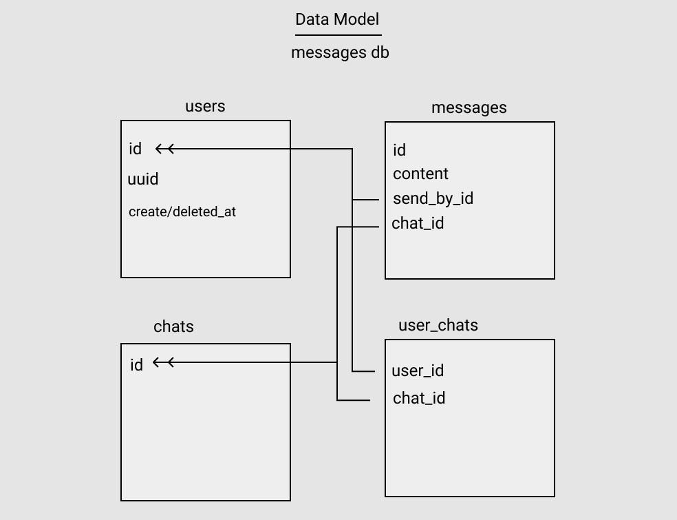

# `simple-message-api`

> simple message API project

### Project Layout

```
{root}
src
├── controllers            # defines methods for interacting with our database
├── db.ts                  # database connection handler
├── handlers.ts            # normalize API request && responses
├── routes.ts              # defines the routes of our API service
├── server.ts              # main entrypoint for our API server, sets up Express.js server + middleware
...
```

- [For API service endpoints refer to this doc](./API.md)

### Requirements

- [Node >= 14](https://nodejs.org/en/download/)
- [Docker](https://docs.docker.com/get-docker/)
- [NVM](https://github.com/nvm-sh/nvm)

### Setup

- nvm use
- npm i
- make migrate

### Development

- `make dcu`
- `make dev`

Other dev tasks

#### Testing

- `npm test` # make sure server is not also running

#### Formatting

- `npm run format` uses prettier

#### Linting

- `npm run format` uses eslint

### Database Change Management

Create new migration

- `npx knex migrate:make <migration_name> -x ts`

Running migrations

- `npx knex migrate:latest --env <env>` where _env_ can be development, staging or production
- `npx knex migrate:rollback` rollback latest
- `npx knex migrate:list` list pending migrations
- For a list of all commands available from knex checkout [this doc](https://knexjs.org/#Migrations)

### Data Model


